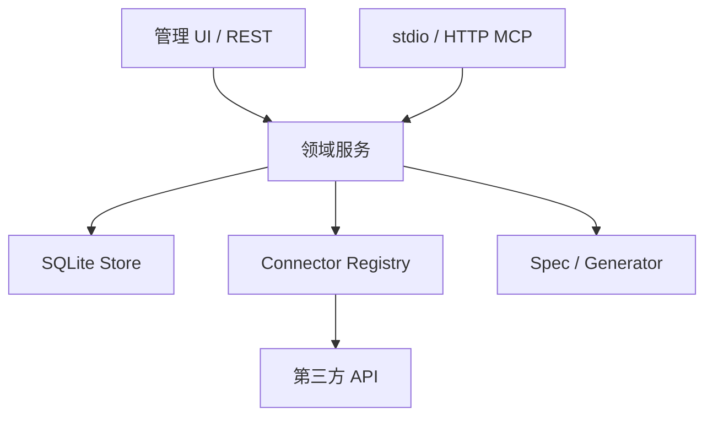

# 架构设计

## 分层

### 接口层

- HTTP 路由只处理认证、输入解析、状态码和响应。
- MCP 工具只做 schema 映射，不实现业务逻辑。
- CLI 只负责进程模式和配置。

### 领域层

- `AuthService`：用户、密码和访问令牌。
- `InterviewService`：访谈状态机和答案合并。
- `WorkbenchService`：Spec、版本、修订和回滚。
- `ActionService`：写操作申请、审批、执行和防重放。
- `OAuthService`：上游 OAuth PKCE 状态和加密凭据。

### 基础设施层

- SQLite 开启 foreign keys、WAL 和 busy timeout。
- 敏感令牌只保存 SHA-256 摘要；上游 OAuth token 使用 AES-256-GCM 加密。
- 连接器适配器负责请求构造和响应归一化。

## 信任边界

- stdio 调用者继承本地进程权限；设置 `WORKBENCH_TOKEN` 时通过该 token 绑定持久化用户，否则只提供无状态与本地文件工具。
- HTTP 调用必须使用 Bearer token，token 只返回一次。
- 用户只能访问自己创建的访谈、工作台和动作；管理员可读取审计日志。
- MCP 入站 token 不能透传给第三方 API。
- 写操作定义来自已校验 Spec，执行前仍需一次性审批。
